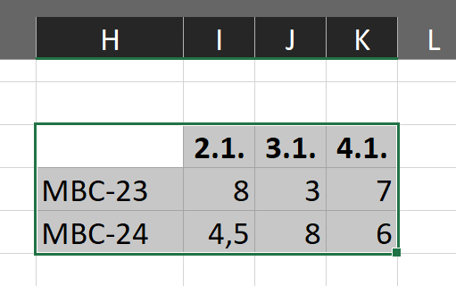
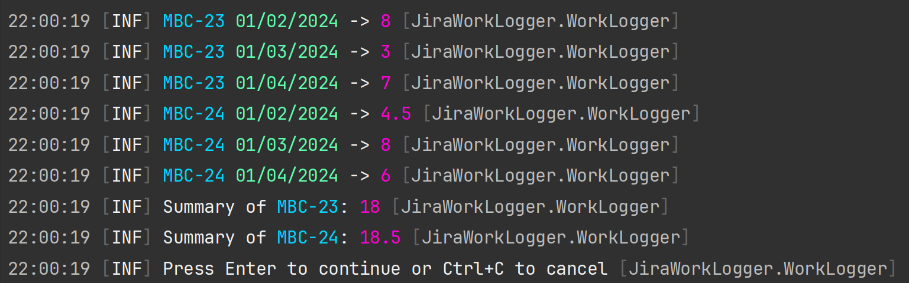
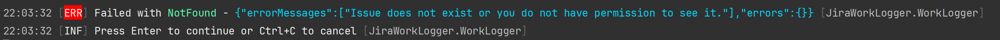

# Jira Work Logger

## Description

A simple console application created for my own needs. It allows to create work logs in Jira issues from Excel records (or from any similarly formatted text).



For the records in the image above, it creates the following work logs in Jira issues:
- MBC-23: Jan 2 -> 8h
- MBC-23: Jan 3 -> 3h
- MBC-23: Jan 4 -> 7h
- MBC-24: Jan 2 -> 4h 30m
- MBC-24: Jan 3 -> 8h
- MBC-24: Jan 4 -> 6h

## Configuration

### 1. Get API token for Atlassian Account

Follow instructions here: https://support.atlassian.com/atlassian-account/docs/manage-api-tokens-for-your-atlassian-account/#Create-an-API-token

### 2. Add configuration to User Secrets

```shell
cd ./src/JiraWorkLogger

dotnet user-secrets set "app:baseUrl" "https://<your-site-name>.atlassian.net/"
dotnet user-secrets set "app:username" "username@example.com"
dotnet user-secrets set "app:apiToken" "XYZ.........."
```

## How to use Jira Work Logger

- Run console application
- Copy cell range from Excel similar to the image above
  - The first column contains Jira issue key
  - The first row contains dates
  - Value in the other cells contains time in hours to log
- Alternatively you can copy text directly from any editor
  - For the sample above it should looks like this
    ```text
    \t2.1.\t3.1.\t4.1.
    MBC-23\t8\t3\t7
    MBC-24\t4,5\t8\t6
    ```
- Paste text from Excel (or the direct text) into console when asked by the application
- Press <kbd>Enter</kbd>
- Check recapitulation of parsed data  
    
  - You can check summary per issue key
- Press <kbd>Enter</kbd>
- Watch console and enjoy as you work is logged in Jira issues 🎉

## Errors

If any record cannot be processed and API call gets error result, processing is stopped and error message with details is shown. You can choose to continue to process other records or stop with <kbd>Ctrl</kbd> + <kbd>C</kbd>


